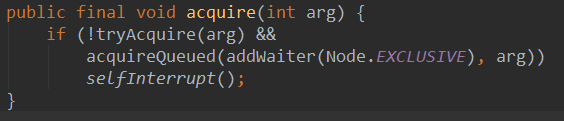
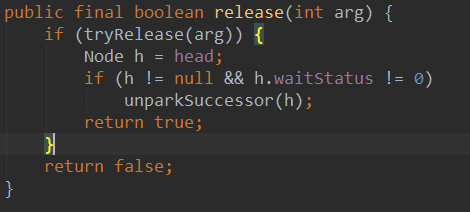
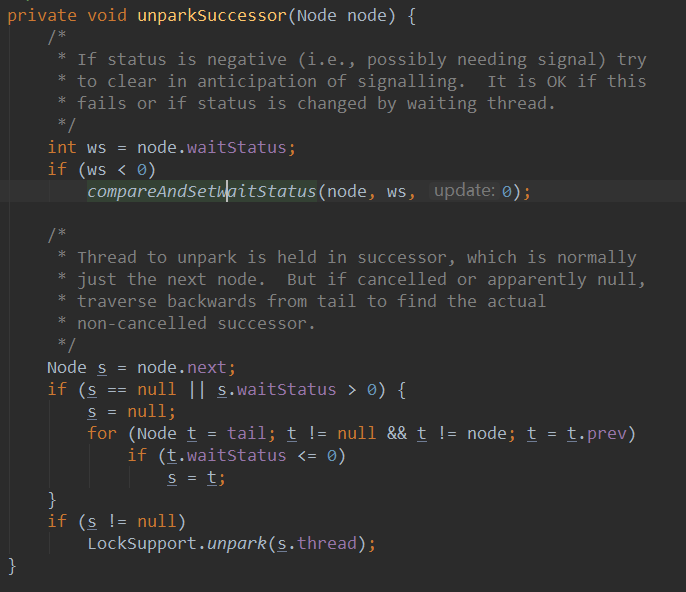

## AbstractQueuedSynchronizer(AQS的理解)  
抽象的队列式的同步器，AQS定义了一套多线程访问共享资源的同步器框架，许多同步类实现都依赖于它，如常用的ReentrantLock/Semaphore/CountDownLatch...。
[博客链接](https://www.cnblogs.com/waterystone/p/4920797.html)  
### ***实现原理***:  
它维护了一个volatile int state（代表共享资源）和一个FIFO线程等待队列（多线程争用资源被阻塞时会进入此队列）。
### ***获取锁过程***:  
#### 请求过程：

* tryAcquire()尝试直接去获取资源，如果成功则直接返回；
* addWaiter()将该线程加入等待队列的尾部，并标记为独占模式；
* acquireQueued()使线程在等待队列中获取资源，一直获取到资源后才返回。如果在整个等待过程中被中断过，则返回true，否则返回false。
* 如果线程在等待过程中被中断过，它是不响应的。只是获取资源后才再进行自我中断selfInterrupt()，将中断补上。  

在同步器中：把每个线程封装成一个Node数据结构，里面有一个模式，表示线程的状态  
* CANCELLED：值为1，在同步队列中等待的线程等待超时或被中断，需要从同步队列中取消该Node的结点，其结点的waitStatus为CANCELLED，即结束状态，进入该状态后的结点将不会再变化。
* SIGNAL：值为-1，被标识为该等待唤醒状态的后继结点，当其前继结点的线程释放了同步锁或被取消，将会通知该后继结点的线程执行。说白了，就是处于唤醒状态，只要前继结点释放锁，就会通知标识为SIGNAL状态的后继结点的线程执行。
* CONDITION：值为-2，与Condition相关，该标识的结点处于等待队列中，结点的线程等待在Condition上，当其他线程调用了Condition的signal()方法后，CONDITION状态的结点将从等待队列转移到同步队列中，等待获取同步锁。
* PROPAGATE：值为-3，与共享模式相关，在共享模式中，该状态标识结点的线程处于可运行状态。
* 0状态：值为0，代表初始化状态。  

AQS在判断状态时，通过用waitStatus>0表示取消状态，而waitStatus<0表示有效状态。  
#### 流程图：

### ***释放锁过程***:  
tryRelease()：释放state，如果有下一个线程唤醒下一个有效线程

下个线程唤醒之后，再次自旋检测到自己是老二，可以获得资源，那么就开始往下运行